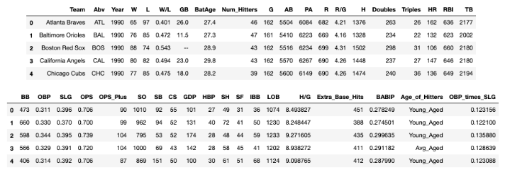

<h1># Flatiron_Mod_2_Project</h1>
Flatiron School Mod 2 Project - Linear Regression - Predict number of runs a team will score in a season
  
<h2><b>Project goals: </b> run linear regression model to try to predict number of runs that a MLB team will score in a season using yearly team hitting statistics. </h2>
The data used for this project came from baseball-reference.com. The initial dataframe consisted of each team's seasonal hitting statistics from 1990-2018 (excluding 1994-1995 due to MLB strike). Data was split into 2 groups: 1990-2017 and 2018 for testing. 
Preview of Dataframe:  
 

Columns include: 'Team', 'W', 'L', 'W/L', 'GB', 'Abv', 'Num_Hitters', 'BatAge', 'R/G', 'G', 'PA', 'AB', 'R', 'H', 'Doubles', 'Triples', 'HR', 'RBI', 'SB', 'CS', 'BB', 'SO', 'BA', 'OBP', 'SLG', 'OPS', 'OPS_Plus', 'TB', 'GDP', 'HBP', 'SH', 'SF', 'IBB', 'LOB', 'Year', 'H/G', 'Extra_Base_Hits', 'BABIP', 'OBP_times_SLG', 'Age_of_Hitters' 
Target Variable: Runs in a season  
Independent Variables: PA, LOB, OBP, OBP_times_SLG (interaction variable created) 
Model: R ~ PA + LOB + OBP + OBP_times_SLG 

Distributions: (ADD PICTURES OF DISTRIBUTIONS HERE)  

3D visualizations: (ADD PICTURES OF 3D GRAPHS HERE)  

Regression Analysis: (INSERT PICTURE OF REGRESSION HERE) 
Interpretation of Coeffitients: (ADD INTERPRETATIONS HERE) 
Q-Q Plot: (ADD PICTURE OF Q-Q PLOT HERE)  
Residual Plots: (ADD PICTURE OF RESIDUAL PLOTS HERE) 

<h2><b> TEST MODEL ON STATS FROM 2018:</h2> 
(ADD PICTURES OF CODE WRITTEN TO TEST 2018 DATA HERE) 

<h2>Hypothesis Test:</h2> 
The New York Yankees have won the most World Series Championships within the span of 1990-2018 (5). Let's look into how they match up to the rest of the MLB in terms of runs scored. 
H0: The mean runs for NYY = the mean runs for of all of MLB 
Ha: The mean runs for NYY > the mean runs for of all of MLB 

(ADD PICTURE OF CODE WRITTEN TO FIND Z SCORE HERE) 
<b>With a z score of .95 we fail to reject the null hypothesis
